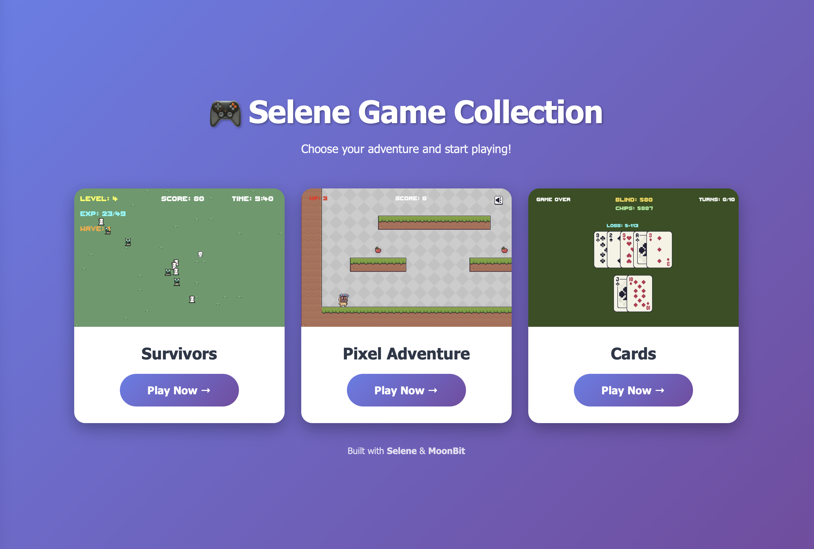

# Selene Game Engine [中文版](./README-zh.md)

## Directory Structure

The [examples](examples/) directory contains sample game projects.

The [selene-core](selene-core/) directory is the core of the Selene engine.

The [selene-canvas](selene-canvas/) directory is the officially maintained Canvas2D API-based backend for Selene. The Selene engine must run with a backend.

## For [MGPIC 2025](https://www.moonbitlang.cn/2025-mgpic) Participants

In principle, the competition only requires the output to be a static HTML5 game, with core logic written in MoonBit. The implementation details are open-ended. Contestants are encouraged to brainstorm and build everything from scratch.

For example, participants can freely choose which Web APIs to use, write JavaScript FFI by hand, use [rabbit-tea](https://github.com/moonbit-community/rabbit-tea) to draw the UI, or even develop a MoonBit Extension for an existing engine and use that engine to build the game. (Cross-platform compatibility is a plus!)

For those who prefer to focus on high-level game logic, building games on top of the Selene engine provides a very friendly entry point.

For more information about the Selene engine, see the [README](./selene-core/README.md), [docs](./docs/tutorial-zh.md), and [examples](./examples/).

## Version Compatibility

From August 10, 2025 until the end of the competition, the `0.10.x` series will remain stable and will not introduce any breaking changes.

After the competition, this project will continue to be maintained, but backward compatibility is not guaranteed.

Contributions are welcome!
