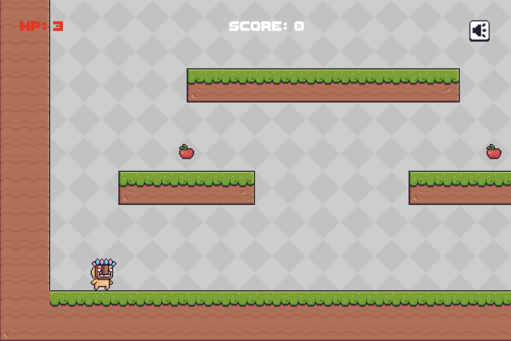

# Selene 使用教程（中文）

该教程会让你快速体验 Selene 游戏引擎。

## 认识 Selene

Selene 是一个实验性质的引擎，鼓励用户基于程序设计最基本的功能挥发创意。

Selene 有如下特点：

- 免费并开源
- 简单：代码非常精简，核心逻辑使用纯 MoonBit 实现（Backend 通过平台模块提供）
- 模块化：可以只导入需要的模块，并通过 wrapper 选择后端
- 高效：借助 MoonBit 的性能优势和 ECS 架构，运行效率高

目前 Selene 已支持 2D/3D 渲染、输入系统、UI、物理、Tiled/LDtk 集成等能力，也欢迎大家持续参与完善。

## 运行案例

确保你已经安装 [MoonBit 工具链](https://www.moonbitlang.com/download/)，并学会基本的使用。

克隆这个仓库：

```shell
git clone https://github.com/moonbit-community/selene.git
```

进入 examples 目录并构建 Web 示例：

```shell
cd examples
moon update
moon build ./pixeladventure/web --target js --release
```

使用任何 Web 服务器运行，例如 Python：

```shell
python3 -m http.server 8000
```

运行成功后，打开浏览器访问 `http://localhost:8000/pixeladventure/` 即可游玩。

接下来你可以尝试修改源码中的部分代码，例如调整游戏画面的大小、缩放比例和帧率，然后重新构建、运行，很快就能对这个案例游戏和 Selene 引擎有初步了解。

## 做你的第一个游戏

本章将介绍如何使用 Selene 制作一个完整的平台跳跃游戏。通过实际开发过程，学习引擎核心功能和开发技巧。

### 示例游戏展示

我们将要制作的游戏如下：



我们会在流程中展示如何制作：

- 绿色草地瓦片
- 一个可控制的人物
- 可移动的摄像机
- 收集道具苹果
- 分数显示框
- 音量控制按钮

玩家可以使用方向键控制人物移动和跳跃。吃到苹果会增加分数。音量按钮可以控制游戏声音开关。

### 项目创建与配置

先安装 MoonBit CLI。若使用 VS Code，建议安装 MoonBit 插件，方便提示和跳转。

使用 `moon new` 创建项目后，可以参考 `examples/pixeladventure` 的组织方式：

- `pixeladventure`：共享游戏逻辑包、场景运行时桥接，以及资源引用
- `pixeladventure/web`：Web 入口 wrapper（通过 `overrides` 选择 webgpu 后端）

### 素材准备

游戏所需图片和音频素材可从以下地址获取：

- [图片素材](https://pixelfrog-assets.itch.io/pixel-adventure-1)
- [音频素材](https://brackeysgames.itch.io/brackeys-platformer-bundle)

将素材放入项目资源目录，例如 `assets/pixeladventure/...`。

当前示例还会把 Selene 项目清单和启动场景与游戏代码放在一起：

- `selene.project.json`：项目入口和资源索引
- `scenes/main.scene.json`：启动场景文档

### 引擎依赖安装

为项目添加 Selene 依赖：

```bash
moon add Milky2018/selene
moon add Milky2018/selene_webgpu
```

如果你需要原生后端，也可以添加：

```bash
moon add Milky2018/selene_raylib
```

核心逻辑包可按需导入模块。下面是 `examples/pixeladventure/moon.pkg` 的导入示例：

```moonbit
import {
  "Milky2018/selene/app",
  "Milky2018/selene/animation",
  "Milky2018/selene/asset",
  "Milky2018/selene/audio",
  "Milky2018/selene/editor_bridge",
  "Milky2018/selene/ecs",
  "Milky2018/selene/entity",
  "Milky2018/selene/event",
  "Milky2018/selene/inputs",
  "Milky2018/selene/math",
  "Milky2018/selene/physics2d",
  "Milky2018/selene/plugins",
  "Milky2018/selene/sprite",
  "Milky2018/selene/time",
  "Milky2018/selene/transform",
  "Milky2018/selene/ui",
  "moonbitlang/core/json",
  "moonbitlang/x/fs",
}
```

Web wrapper（`examples/pixeladventure/web/moon.pkg`）示例：

```moonbit
import {
  "Milky2018/selene-examples/pixeladventure" @pixeladventure_game,
}

supported_targets = "js"

options(
  "is-main": true,
  overrides: [
    "Milky2018/selene_webgpu/platform_window",
    "Milky2018/selene_webgpu/platform_input",
    "Milky2018/selene_webgpu/platform_render",
    "Milky2018/selene_webgpu/platform_audio",
    "Milky2018/selene_webgpu/platform_asset_io",
  ],
  targets: { "main.mbt": [ "js" ] },
)
```

Web wrapper 的 `main.mbt`：

```moonbit
fn main {
  @pixeladventure_game.run()
}
```

Selene 项目的核心是 `App`。在游戏入口中创建应用：

```moonbit
pub fn run() -> Unit {
  @app.App::new()
  .with_viewport_width(480.0)
  .with_viewport_height(320.0)
  .with_image_smooth(false)
  .with_zoom(2.0)
  .with_fps(60)
  .add_plugin(@plugins.default_plugin)
  .add_system(Startup, game_start)
  .add_system(Update, player_controller_system)
  .add_system(Update, trigger_system)
  .add_system(Update, pixeladventure_camera_follow_system)
  .add_system(FixedPostUpdate, player_bird_contact_system)
  .add_system(FixedPostUpdate, bird_patrol_system)
  .add_system(PostUpdate, volume_button_system)
  .add_system(PostUpdate, hud_sync_system)
  .run()
}
```

`App` 会按调度阶段执行系统函数。每个系统负责特定功能，例如输入、碰撞、渲染或 UI。

### 游戏状态管理

全局游戏状态包含玩家引用、分数、音量设置等。当前示例把 session 数据和玩家控制器数据拆开存放：

```moonbit
struct GameSession {
  player : @entity.Entity
  camera : @entity.Entity
  result_box : @entity.Entity
  score_box : @entity.Entity
  health_box : @entity.Entity
  volume_button : @entity.Entity
  mut score : Int
  mut volume_on : Bool
  mut health : Int
  mut result : GameResult?
  world_size : @math.Vec2
}

struct PlayerController {
  mut facing : Direction2
  mut state : PlayerState
  mut hurt_cooldown : Double
  mut pending_bounce_velocity_y : Double?
}
```

### 实体和组件

游戏对象由实体（Entity）和组件（Component）表示。实体是唯一标识符，组件存放数据。创建玩家实体示例：

```moonbit
let player = @entity.Entity::new()
@transform.transforms().set(player, @transform.Transform::from_xyz(100.0, 100.0, 0.0))
@physics2d.linear_velocities().set(player, @math.Vec2::zero())
```

上述代码做了三件事：

1. 创建实体
2. 设置位置组件
3. 设置速度组件

Entity 类似引用，组件通过 `Map[K, V]::set` 关联到实体上。`@transform.transforms()` 和 `@sprite.sprites()` 都是组件存储映射。

这类初始化逻辑应放在 `Startup` 阶段系统中执行一次。

### 玩家角色实现

玩家角色通常有多个动画状态：空闲、跑步、跳跃和下落。以空闲动画为例：

```moonbit
let player_idle_layout = @sprite.register_texture_atlas_layout(
  @sprite.TextureAtlasLayout::from_grid(@math.Vec2(32.0, 32.0), 11, 1),
)
let player_idle_image = @asset.load_image(
  "assets/pixeladventure/Main Characters/Mask Dude/Idle (32x32).png",
)
```

`TextureAtlasLayout` 用来描述 atlas 中每一帧的矩形区域，运行时真正被动画系统修改的是 `TextureAtlas.index`。

通过 clip / graph / player 把 sprite 动画挂到实体上：

```moonbit
@sprite.sprites().set(
  player,
  @sprite.Sprite::from_atlas_image(
    player_idle_image,
    @sprite.TextureAtlas::new(player_idle_layout),
  ),
)
let clip = @animation.AnimationClip::new("player_idle")
let frame_keys : Array[@animation.ScalarKeyframe] = []
for index in 0..<11 {
  frame_keys.push({
    time: index.to_double() / 12.0,
    value: index.to_double(),
    in_tangent: None,
    out_tangent: None,
  })
}
clip.add_curve_to_target(
  @animation.AnimationTargetId::new("self"),
  @animation.VariableCurve::scalar(
    @animation.texture_atlas_index_field(),
    frame_keys,
    interpolation=@animation.ChannelInterpolation::Step,
  ),
)
let (graph, nodes) = @animation.AnimationGraph::from_clips([
  @animation.register_animation_clip_asset(clip),
])
@animation.animation_graph_handles().set(
  player,
  @animation.register_animation_graph_asset(graph),
)
@animation.animation_players().set(
  player,
  @animation.AnimationPlayer::new(),
)
@animation.animation_target_ids().set(
  player,
  @animation.AnimationTargetId::new("self"),
)
@animation.animated_bys().set(
  player,
  @animation.AnimatedBy::new(player),
)
ignore(
  @animation.animation_players().get(player).unwrap().play(
    nodes[0],
    repeat=@animation.RepeatAnimation::Forever,
  ),
)
```

玩家状态机可根据速度和地面接触切换动画状态。输入处理使用 `@inputs` 模块：

```moonbit
if @inputs.is_pressed(@inputs.ArrowLeft) {
  // 向左移动
} else if @inputs.is_pressed(@inputs.ArrowRight) {
  // 向右移动
}

if @inputs.is_just_pressed(@inputs.ArrowUp) && @physics2d.is_grounded(player) {
  // 跳跃
}
```

`@inputs.is_pressed` 表示持续按住，`@inputs.is_just_pressed` 表示刚刚按下。

### 障碍物和碰撞

为了让玩家不会穿透障碍物，需要配置碰撞组、形状和碰撞体：

```moonbit
let terrain_collision_group = @physics2d.CollisionGroup::new()
let player_collision_group = @physics2d.CollisionGroup::new()

@physics2d.shapes().set(
  player,
  Rect(size=@math.Vec2(24.0, 32.0), offset=@math.Vec2(4.0, 0.0)),
)
@physics2d.colliders().set(
  player,
  @physics2d.Collider::new(
    @physics2d.CollisionFilter::new(player_collision_group, [
      terrain_collision_group,
    ]),
  ),
)
```

只有过滤规则允许的碰撞组之间才会发生碰撞。

### 场景文档与关卡加载

直接手写整张地图不方便。当前示例使用 Selene 项目清单和启动场景文档，再在运行时把它们实例化出来。

`editor_scene.mbt` 中的加载流程大致如下：

```moonbit
let bundle = load_pixeladventure_project_bundle_with_source(source)
let scene = bundle.scene
let context = @editor_bridge.asset_instantiation_context(
  atlas_assets=bundle.atlas_assets,
  animation_clip_assets=bundle.animation_clip_assets,
  animation_graph_assets=bundle.animation_graph_assets,
  custom_component_handlers=pixeladventure_custom_component_handlers(),
)
let runtime = @editor_bridge.instantiate_scene_document_with_context(
  scene,
  context,
)
```

### 摄像机

当地图大于视口时，可以每帧更新摄像机实体的位置，并把它夹在关卡边界内：

```moonbit
let target_x = player_transform.translation.x + 16.0
let target_y = player_transform.translation.y + 16.0
let center_x = target_x.clamp(half_width, session.world_size.x - half_width)
let center_y = target_y.clamp(half_height, session.world_size.y - half_height)
@transform.transforms().set(
  session.camera,
  @transform.Transform::from_xyz(center_x, center_y, 0.0),
)
```

### 区域和音频

苹果不会阻挡玩家移动，但会触发“收集”事件。示例中给苹果添加 `Area` 组件，并在系统中检测包含关系：

```moonbit
let area = @physics2d.Area::new(
  @physics2d.CollisionFilter::new(trigger_collision_group, [
    player_collision_group,
  ]),
)
@physics2d.areas().set(apple, area)

fn map_trigger_system(_world : @ecs.World) -> Unit {
  for apple in apples.to_array() {
    if @physics2d.get_contains(apple).contains(session.player) {
      session.score += 10
      if session.volume_on {
        play_sfx(coin_sound, session.volume_on)
      }
      apple.destroy()
      apples.remove(apple)
    }
  }
}
```

播放音效可通过音频事件发送：

```moonbit
fn play_sfx(sound : @audio.AudioHandle, enabled : Bool) -> Unit {
  if enabled {
    @audio.send_audio_event(sound, settings=@audio.PlaybackSettings::remove())
  }
}
```

### 用户界面

当前 UI 使用 `@ui` 组件体系创建文本和按钮。例如分数文本：

```moonbit
fn add_score_box() -> Unit {
  @ui.nodes().set(
    session.score_box,
    @ui.Node::absolute(
      @math.Vec2(48.0, 16.0),
      size=@math.Vec2(432.0, 24.0),
    ),
  )
  @ui.z_indexes().set(session.score_box, @ui.ZIndex::new(100))
  @ui.texts().set(session.score_box, @ui.Text::new("Score: 0"))
  @ui.text_fonts().set(session.score_box, @ui.TextFont::from_css("20px ThaleahFat"))
}
```

音量按钮通过 `click_event_bus` 读取点击事件：

```moonbit
let ui_click_reader : @event.EventReader[@ui.UiClickEvent] = @event.EventReader::new()

fn volume_button_input_system(_world : @ecs.World) -> Unit {
  for event in @ui.click_event_bus.read(ui_click_reader) {
    guard event.entity == session.volume_button else { continue }
    session.volume_on = !session.volume_on
  }
}
```

### 编译与游玩

构建命令：

```shell
cd examples
moon build ./pixeladventure/web --target js --release
```

构建后可直接使用 `examples/pixeladventure/index.html`，其中脚本路径如下：

```html
<script src="../../_build/js/release/build/Milky2018/selene-examples/pixeladventure/web/web.js" defer></script>
```

然后启动本地 Web 服务：

```shell
python3 -m http.server 8000
```

访问 `http://localhost:8000/pixeladventure/` 即可游玩。

游戏完整源码： [Selene Example](https://github.com/moonbit-community/selene/tree/main/examples/pixeladventure)

## 下一步

恭喜你完成了第一个 Selene 游戏。通过这个教程，你已经掌握了引擎的核心概念和开发流程。接下来你可以：

- 扩展游戏功能：添加更多关卡、敌人、道具或机制
- 优化游戏体验：改进角色动画、音效和视觉反馈
- 参与社区贡献：在 [GitHub](https://github.com/moonbit-community/selene) 上报告问题、提交建议或贡献代码
- 创作原创游戏：用所学知识开发你自己的游戏项目

Selene 不仅可以用来制作游戏，也可以用于构建需要图形界面的交互应用。发挥你的创意，用 MoonBit 和 Selene 构建出色作品。
