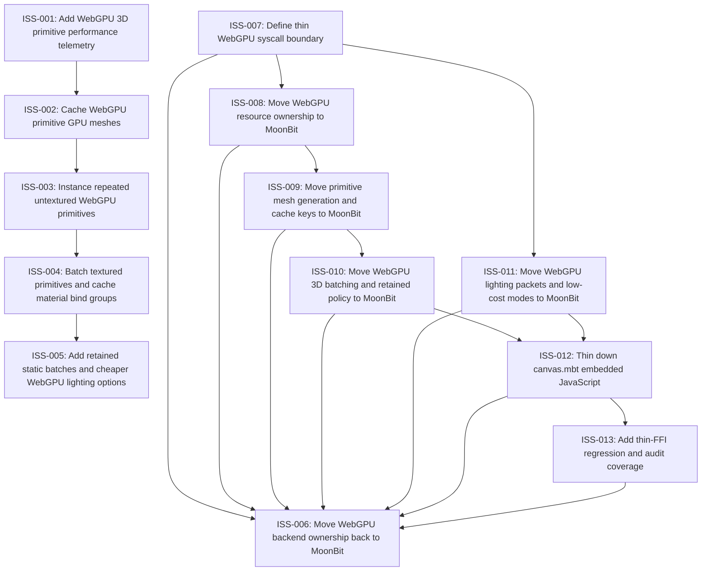

# Markdown Issue Index

Generated by derive-tracker.wasm

## Ready Queue

| ID | Priority | Type | Assignee | Title | Labels |
| --- | ---: | --- | --- | --- | --- |
| [ISS-008](ISS-008.md) | 1 | task | unassigned | Move WebGPU resource ownership to MoonBit | webgpu, resources, ffi |
| [ISS-011](ISS-011.md) | 2 | task | unassigned | Move WebGPU lighting packets and low-cost modes to MoonBit | webgpu, render3d, lighting |

## Unresolved Issues

| ID | Status | Priority | Type | Assignee | Blocked by | Blocks | Title |
| --- | --- | ---: | --- | --- | --- | --- | --- |
| [ISS-006](ISS-006.md) | open | 1 | epic | unassigned | ISS-008, ISS-009, ISS-010, ISS-011, ISS-012, ISS-013 | none | Move WebGPU backend ownership back to MoonBit |
| [ISS-008](ISS-008.md) | open | 1 | task | unassigned | none | ISS-006, ISS-009 | Move WebGPU resource ownership to MoonBit |
| [ISS-009](ISS-009.md) | open | 1 | task | unassigned | ISS-008 | ISS-006, ISS-010 | Move primitive mesh generation and cache keys to MoonBit |
| [ISS-010](ISS-010.md) | open | 1 | task | unassigned | ISS-009 | ISS-006, ISS-012 | Move WebGPU 3D batching and retained policy to MoonBit |
| [ISS-012](ISS-012.md) | open | 1 | task | unassigned | ISS-010, ISS-011 | ISS-006, ISS-013 | Thin down canvas.mbt embedded JavaScript |
| [ISS-011](ISS-011.md) | open | 2 | task | unassigned | none | ISS-006, ISS-012 | Move WebGPU lighting packets and low-cost modes to MoonBit |
| [ISS-013](ISS-013.md) | open | 2 | task | unassigned | ISS-012 | ISS-006 | Add thin-FFI regression and audit coverage |

## Dependency Graph

## Warnings

None.

